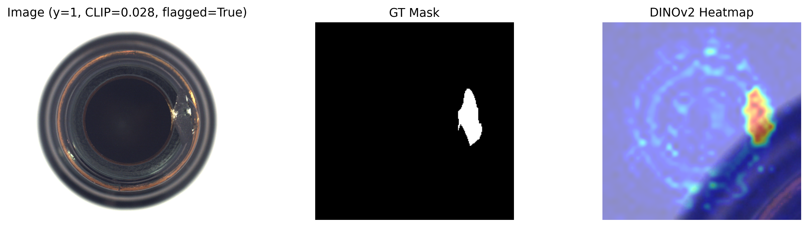
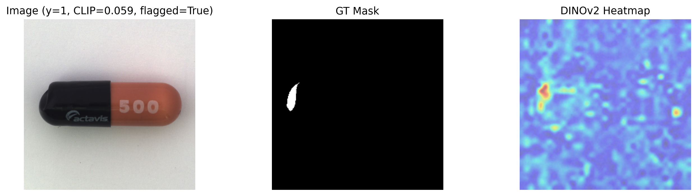
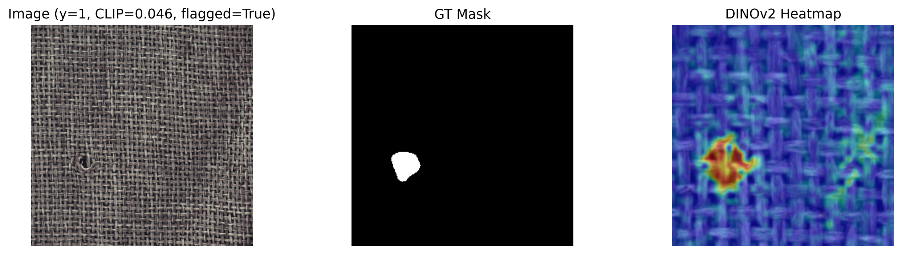
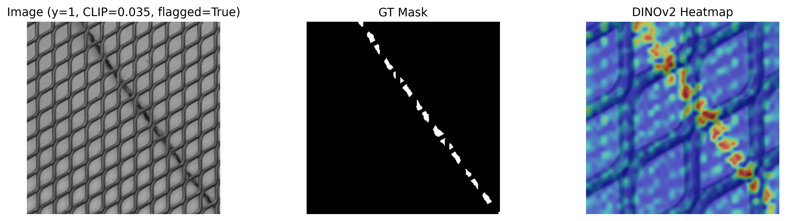

# Hybrid-ZeroShot-Anomaly-Detection

Bu proje, **CLIP** ve **DINOv2** modellerini kullanarak üretim/sanayi verilerinde (örn. MVTec AD veri seti) sıfır-örneklem (zero-shot) anomali tespiti yapmayı amaçlayan melez (hibrit) bir yaklaşım sunmaktadır. Bu çalışma, konuyla ilgili akademik bir makale için hazırlanmış olup kodun tam ve çalıştırılabilir halini içermektedir.

## Yöntemler ve Yaklaşımlar

Proje, üç farklı anomali tespit yaklaşımını analiz etmekte ve karşılaştırmaktadır:

1. **Hybrid (Hibrit) Yaklaşım**: 
   - **CLIP** modeli kullanılarak görüntüler ön taramadan geçirilir (image-level filtreleme). Bu aşama oldukça hızlıdır.
   - Sadece şüpheli ("flagged") olarak işaretlenen görüntüler **DINOv2** modeline gönderilerek detaylı piksel bazlı (pixel-level) lokalizasyon analizi yapılır.
   - Bu yöntem sayeside hem hız hem de yüksek detaylı lokalizasyon başarısı elde edilir.
   
2. **CLIP-only Yaklaşım**:
   - Sadece CLIP modelini kullanarak görüntü düzeyinde (image-level) anomali tespiti yapılır. Lokalizasyon sağlamaz ancak hızlı çalışır.
   
3. **DINO-only Yaklaşım**:
   - Herhangi bir ön filtreleme yapmaksızın sadece DINOv2 modeli kullanılarak piksel düzeyinde anomali tespiti ve lokalizasyon yapılır. En yüksek hesaplama maliyetine sahiptir fakat en detaylı analizi sunar.

## Kullanılan Veri Seti (MVTec AD)

Bu çalışmada, endüstriyel görsel hata tespiti (industrial visual anomaly detection) alanında standart ve yaygın olarak kullanılan halka açık bir veri seti olan **MVTec AD** (Anomaly Detection) kullanılmıştır. 
Veri setini incelemek ve indirmek için resmi bağlantıyı ziyaret edebilirsiniz:  
🔗 [MVTec AD Dataset Official Page](https://www.mvtec.com/company/research/datasets/mvtec-ad)

## Motivasyon ve Araştırma Kapsamı (Scope)

**Önemli Not:** Bu çalışmanın birincil amacı, mevcut literatürdeki en yüksek (State-of-the-Art / SOTA) anomali tespit skorunu elde etmek **değildir.** 
Ana motivasyonumuz; CLIP gibi görüntü bazında (image-level) oldukça hızlı çalışan ancak lokalizasyon yeteneği olmayan bir model ile, DINOv2 gibi piksel bazında (pixel-level) çok detaylı ve başarılı lokalizasyon yapabilen ancak hesaplama maliyeti yüksek bir modeli **hibrit (melez)** bir yapıda birleştirmektir. 
Bu "ön-filtreleme" (gating) konsepti sayesinde, endüstriyel üretim hatlarında saniyeler içinde binlerce normal ürünü düşük donanım maliyetiyle eleyip, sadece şüpheli ("flagged") ürünleri ağır anomali haritalandırmasına (DINOv2) sokarak **hız ve doğruluk (işlem maliyeti) arasında optimum bir denge** kurulabileceği kanıtlanmaktadır.

## Kullanılan Teknolojiler ve Tekrarlanabilirlik

- **OpenAI CLIP**: Görüntü bazlı genel anomali özelliklerini çıkarmak ve filtrelemek için.
- **Meta DINOv2**: Piksel bazlı haritalama (patch-level feature extraction), KNN indeksleme ve anomali ısı haritaları (heatmap) oluşturmak için.
- **Python Kütüphaneleri**: `pandas`, `opencv-python`, `scikit-learn`, `ftfy`, `regex`, ve veri yönetimi için PyTorch altyapısı.
- **Tekrarlanabilirlik (Reproducibility) ve Cihaz Ayarları**: Deneylerin tutarlı ve akademik anlamda tekrarlanabilir olması için rastgelelik tohumu (seed) `SEED = 42` olarak (Numpy, Random ve PyTorch CPU/GPU fonksiyonları düzeyinde) sabitlenmiştir. Deneyler aşağıdaki donanım konfigürasyonunda referans alınarak koşturulmuştur:
  - **Kullanılan cihaz**: `cuda`
  - **GPU**: NVIDIA RTX PRO 6000 Blackwell Server Edition
  - **GPU Belleği**: 101.97 GB

## Deneysel Sonuçlar (Experimental Results)

MVTec AD veri setindeki tüm 15 kategori üzerinde yapılan karşılaştırmalı deney sonuçlarının ortalamaları aşağıda özetlenmiştir. Hibrit yaklaşım için CLIP eşik değeri (threshold quantile) **0.93** olarak seçilmiştir:

| Yöntem | Ortalama İmaj AUROC | Ortalama Piksel AUROC | Filtrelenen (Flagged) Oranı |
|---|---|---|---|
| **CLIP-only** | **%82.63** (0.8263) | - (Lokalizasyon Yok) | %100 (Tümü incelendi) |
| **DINO-only** | %70.34 (0.7034) | **%94.42** (0.9442) | %100 (Tümü ağır işlemden geçti) |
| **Hybrid (CLIP+DINOv2)** | **%82.63** (0.8263) | %80.74 (0.8074) | **%63.97** (Sadece şüpheliler işlendi) |

**Sonuç Analizi:** Tablodan görüleceği üzere, Hybrid yöntem yalnızca görüntülerin **%63.97'sini** DINOv2'ye yönlendirerek büyük bir işlem tasarrufu sağlamıştır. CLIP üzerinden zaten doğal olarak elde edilen imaj tespit başarısının (%82.63) yanına, hibrit geçit (gating) sistemi sayesinde DINOv2'nin detaylı haritalama gücü eklenmiş ve uçtan uca (E2E) piksel bazında **%80.74** gibi oldukça güçlü bir lokalizasyon skoru elde edilmiştir. DINO-only yönteminin %94'lük saf lokalizasyonuna kıyasla yaşanan bu düşüş (trade-off), elde edilen %36'lık devasa donanım/hız tasarrufu göz önüne alındığında endüstriyel kullanımlar için son derece optimumdur. Tüm bu çıktı detayları repo içerisindeki `results/` klasöründe yer almaktadır.

### Eşik Değeri Seçimi (Ablation Study)
Hybrid yapının tam olarak hangi CLIP Skoruna (Quantile) göre fotoğrafları DINOv2'ye yönlendireceğini belirlemek için sistemde bir "Ablation Taraması" (%90, %93, %95, %97, %99 quantile) gerçekleştirilmiştir. Aşağıdaki tabloda optimal dengenin (`0.93 - %93` Quantile) nasıl seçildiği açıkça görülmektedir:

| Seçilen Quantile (Eşik Oranı) | Ortalama İmaj AUROC | Ortalama Kondisyonel Piksel AUROC | Ortalama E2E Piksel AUROC | DINO'ya Yönlendirme Oranı (Flag) |
|---|---|---|---|---|
| 0.90 | 0.8263 | 0.9393 | **0.8204** | %68.43 |
| **0.93 (Seçilen)** | **0.8263** | **0.9395** | 0.8074 | **%63.97** |
| 0.95 | 0.8263 | 0.9378 | 0.7989 | %60.98 |
| 0.97 | 0.8263 | 0.9381 | 0.7891 | %58.60 |
| 0.99 | 0.8263 | 0.9416 | 0.7643 | %52.40 |

*(Seçilen `0.93` eşik değeri ile birlikte filtreleme oranı avantajlı bir şekilde `~%64`'lere çekilirken, uçtan uca lokalizasyon (E2E Piksel AUROC) başarısında ciddi bir zafiyet yaşanmamıştır.)*

## Görsel Analiz (Qualitative Results)

Hibrit anomali tespit pipeline'ının nasıl çalıştığını göstermek adına üretilen 3-panelli kalitatif görseller aşağıdadır. 
**[Panel 1]** Görüntü ve CLIP Eşik Durumu | **[Panel 2]** Ground Truth Hata Maskesi | **[Panel 3]** DINOv2 Isı Haritası (Heatmap) Lokalizasyonu

*(Daha fazla görsel örnek ve detay `results/qual_panels_balanced/` dizini altında bulunabilir.)*

## Çıktılar ve Analiz

Sistem üzerinden aşağıdaki analiz ve değerlendirme hedeflerine ulaşılır:
- Her kategori ve denenen yöntem için ayrı ayrı **AUROC** metriklerinin (görüntü bazlı ve piksel bazlı) hesaplanması.
- Karşılaştırmalı ve detaylı metriklerin **Excel** ve **CSV** formatlarında raporlanması.
- Makale için uygun olan 3-panelli kalitatif görsellerin üretilmesi:
  - Panel 1: Orijinal görüntü, CLIP skoru ve eşik durumu.
  - Panel 2: Ground-truth maske (MVTec AD referansları).
  - Panel 3: DINOv2 ısı haritası (lokalizasyon sonucu).

## Kullanım

Başlamak için depoda yer alan `Hybrid-ZeroShot-Anomaly-Detection.ipynb` Google Colab ortamında veya Jupyter çevresinde çalıştırılabilir. Veri seti dizin yolları Colab içerisinde Google Drive üzerinden çekilecek şekilde ayarlanmıştır. Çalıştırmadan önce `MVTEC_ROOT` dahil dizin yapılarını kendi Google Drive veya lokal sisteminize uygun şekilde düzenlemeniz tavsiye edilir.
